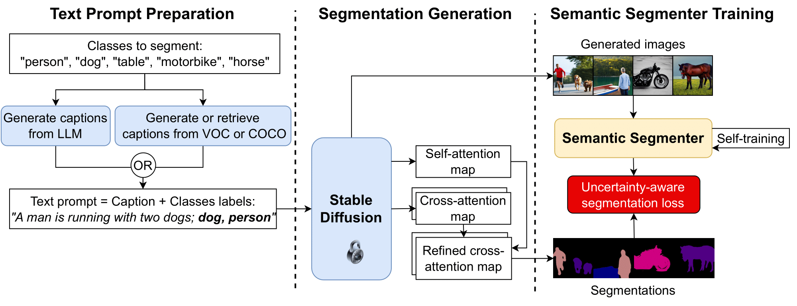

#### **Table of contents**
1. [Introduction](#pytorch-implementation-of-dataset-diffusion-diffusion-based-synthetic-data-generation-for-pixel-level-semantic-segmentation-neurips2023)
1. [Requirements](#requirements)
2. [Usage](#usage-command-lines)
    * [Generate synthetic data](#generating-synthetic-data)
    * [Train the semantic segmenter](#training-the-semantic-segmenter)
3. [Contacts](#contacts)


# **PyTorch implementation of Dataset Diffusion: Diffusion-based Synthetic Data Generation for Pixel-Level Semantic Segmentation (NeurIPS2023)**
<a href="https://arxiv.org/abs/2309.14303"></a>

[Quang Nguyen](https://quang-ngh.github.io/),
[Truong Vu](https://scholar.google.com/citations?user=mTbQ2ZsAAAAJ&hl=vi),
[Anh Tran](https://scholar.google.com/citations?user=FYZ5ODQAAAAJ&hl=en),
[Khoi Nguyen](https://khoinguyen.org)<br>
**VinAI Research, Vietnam**

> **Abstract:** 
Preparing training data for deep vision models is a labor-intensive task. To ad-
dress this, generative models have emerged as an effective solution for generating
synthetic data. While current generative models produce image-level category
labels, we propose a novel method for generating pixel-level semantic segmen-
tation labels using the text-to-image generative model Stable Diffusion (SD). By
utilizing the text prompts, cross-attention, and self-attention of SD, we introduce
three new techniques: class-prompt appending, class-prompt cross-attention, and
self-attention exponentiation. These techniques enable us to generate segmentation
maps corresponding to synthetic images. These maps serve as pseudo-labels for
training semantic segmenters, eliminating the need for labor-intensive pixel-wise
annotation. To account for the imperfections in our pseudo-labels, we incorporate
uncertainty regions into the segmentation, allowing us to disregard loss from those
regions. We conduct evaluations on two datasets, PASCAL VOC and MSCOCO,
and our approach significantly outperforms concurrent work.


Details of the model architecture and experimental results can be found in [our following paper](https://arxiv.org/abs/2309.14303).<br>
Please **CITE** our paper whenever this repository is used to help produce published results or incorporated into other software.
```bibtex
@inproceedings{quangtruong2023@dd,
  title={Dataset Diffusion: Diffusion-based Synthetic Dataset Generation for Pixel-Level Semantic Segmentation},
  author={Quang Ho Nguyen, Truong Vu, Anh Tran, Khoi Nguyen},
  year={2023},
  booktitle={Thirty-Seventh Conference on Neural Information Processing Systems},
}
```

## **Requirements**
* OS: we recommend Linux for performance and compatibility reasons.
* 64-bit Python ≥ 3.8
* PyTorch ≥ 1.10 and torchvision that matches the PYTorch installation. Follow [official instruction](https://pytorch.org/get-started/locally/)
* [HuggingFace installations](https://huggingface.co/docs/diffusers/installation): diffusers, transformers, safetensors
* `pip install --user -U nltk`

Please refer to [INSTALL.md](INSTALL.md) for installations of MMCV and datasets preparation.

## **Usage: Command lines**
### **Generating synthetic data**
* To generate synthetic dataset with VOC classes, run 
```shell
sh scripts/gen_data_voc.sh
```
The dataset will be saved to `data/gen_voc` by default.


* To generate synthetic dataset with COCO classes, run 
```shell
sh scripts/gen_data_coco.sh
```
The dataset will be saved to `data/gen_coco` by default.


### **Training the semantic segmenter**
* To train the semantic segmenter on VOC synthetic dataset, run 
```shell
sh scripts/train_mmseg_voc.sh
```

* To train the semantic segmenter on COCO synthetic dataset, run 
```shell
sh scripts/train_mmseg_coco.sh
```

You can alter the number of GPUs for training specified in these scripts.

##  **Dataset**
The generated dataset is provided [here](https://drive.google.com/file/d/1_4-13V9lfwJneMD-jHmg0Igcf6HV8-F_/view?usp=sharing)
## **Contacts**:
If you have any questions about this project, please don't hestitate to drop me an email quangngcs@gmail.com or open an issue in this repository